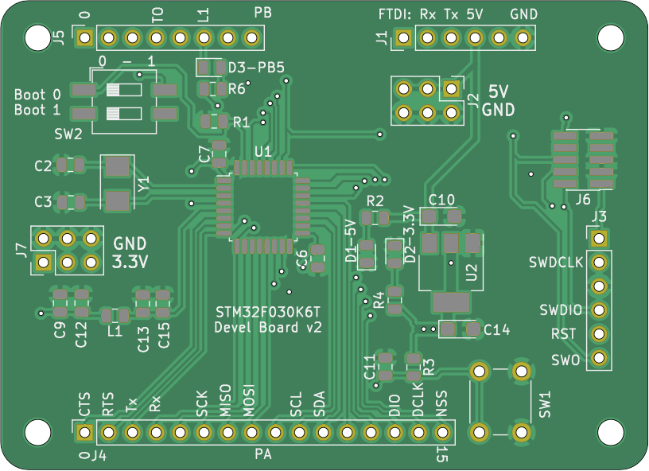

# STM32F103 Devel Board
STM32F103 Board for development with STM32F103CB chip. The intention of this project is to have my own basic board for this chip in order to design custom boards which use the STM32103CB chip.

## Board specs:
* CHIP STM32F103CBT6
  * 128KB Flash / 20 KB RAM
  * 72 MHz Core
  * [https://www.st.com/en/microcontrollers-microprocessors/stm32f103cb.html](https://www.st.com/en/microcontrollers-microprocessors/stm32f103cb.html)
* Board Cristals:
  * HSE Clock: 8 Mhz
  * LSE Clokc: 32.768KHz
* Ports:
  * USB Port
  * SWD 6 pins 2.54
  * SWD 10 pins 1.27
  * PortA and PortB 16 pins 2.54
* 3.3V Regulator:
  * AMS1117-3.3
* Indicator LEDs:
  * 5V
  * 3.3V
  * PB5 (ligh on low)
* Boot selector
  * Boot0 and Boot1 to jumper pins

